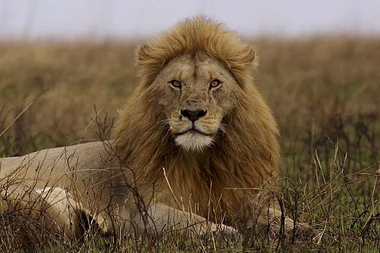

# travellersguideTZ
A travel guide to Tanzania

## Image Attribution

1. 
   - **Description:** Lioness in Serengeti National Park, Tanzania.
   - **Photographer:** Ghost1590
   - **Date:** December 29, 2014
   - **License:** Creative Commons Attribution-Share Alike 4.0
   - **Source:** [Link to Original Image](https://upload.wikimedia.org/wikipedia/commons/thumb/9/91/Lioness%2C_Serengeti%2C_Tanzania.jpg/640px-Lioness%2C_Serengeti%2C_Tanzania.jpg)

2. 
- **Description:** Coat of Arms of Tanzania. The caption reads "Freedom and Unity" in Swahili.
- **Author:** FischX
- **Date:** January 21, 2011
- **License:** Creative Commons Attribution-Share Alike 3.0 Unported license
- **Source:** [Wikimedia Commons](https://upload.wikimedia.org/wikipedia/commons/thumb/c/c2/Coat_of_arms_of_Tanzania.svg/251px-Coat_of_arms_of_Tanzania.svg.png?20110121214742)

3. 
   - **Description:** National flag of Tanzania.
   - **Creator:** Drawn by SKopp, Madden and Alkari
   - **Source:** [Wikimedia Commons](https://upload.wikimedia.org/wikipedia/commons/thumb/3/38/Flag_of_Tanzania.svg/800px-Flag_of_Tanzania.svg.png?20221212120308)
   - **License:** Public Domain

4. 
   - **Description:** This image shows a lion in Serengeti National Park, Tanzania.
   - **Photographer:** Thomas Fuhrmann
   - **Date:** September 5, 2015
   - **License:** Creative Commons Attribution-Share Alike 4.0
   - **Source:** [Link to Original Image](https://upload.wikimedia.org/wikipedia/commons/thumb/f/f2/Serengeti_National_Park_08_-_lion_-_Panthera_leo.jpg/640px-Serengeti_National_Park_08_-_lion_-_Panthera_leo.jpg)

5. 
   - **Description:** Front view of a 1000 Tanzania Shilling banknote.
   - **Photographer:** Ahandrich
   - **Date:** July 2, 2017
   - **License:** Creative Commons Zero, Public Domain Dedication
   - **Source:** [Link to Original Image](https://upload.wikimedia.org/wikipedia/commons/thumb/5/55/TZSn01000v.jpg/640px-TZSn01000v.jpg)
